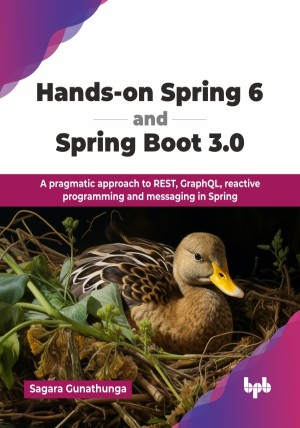

# Hands-on Spring 6 and Spring Boot 3.0

A pragmatic approach to REST, GraphQL, reactive programming and messaging in Spring.

This is the repository for [Hands-on Spring 6 and Spring Boot 3.0
](https://bpbonline.com/products/hands-on-spring-6-and-spring-boot-3-0?variant=44495135703240),published by BPB Publications.

## About the Book
The demand for developers skilled in Spring and Spring Boot remains strong, reflecting the frameworks' key roles in modern software development and the constant expansion of Java-based applications across industries.       

This technical guide to Spring Framework 6 and Spring Boot 3.0 employs a scenario-based methodology, systematically addressing enterprise-grade concerns, including TDD, security, and observability. The content progressively builds a complete application, with each chapter expanding specific components while maintaining a focus on production-ready implementation patterns. A companion GitHub repository provides complete source code, allowing readers to focus on critical concepts. The book's architecture progresses from fundamental Spring concepts through practical implementations of MVC applications, data persistence, REST/GraphQL APIs, reactive programming, and messaging systems, concluding with deployment strategies and emerging Spring technologies. All examples follow enterprise-quality standards applicable to real-world development scenarios.

This book provides fundamental concepts for beginners starting on their journey with Spring and Spring Boot, enabling them to rapidly transition to developing real-world applications and services. It also serves as a valuable resource for Spring developers seeking to enhance their expertise with Spring Framework 6 and Spring Boot 3.0.  

## What You Will Learn
• Learn the fundamentals of Spring and get started with Spring Boot.

• Build enterprise web applications, RESTful and GraphQL services. 

• Adopt test-driven development and apply security and observability effectively.

• Develop a real-world application together. 

• Learn best practices for running enterprise applications in production.

• Developing Spring MVC web applications and working with relational and non-relational data.

• Interdiction to reactive programming and developing reactive services using Spring Boot.
